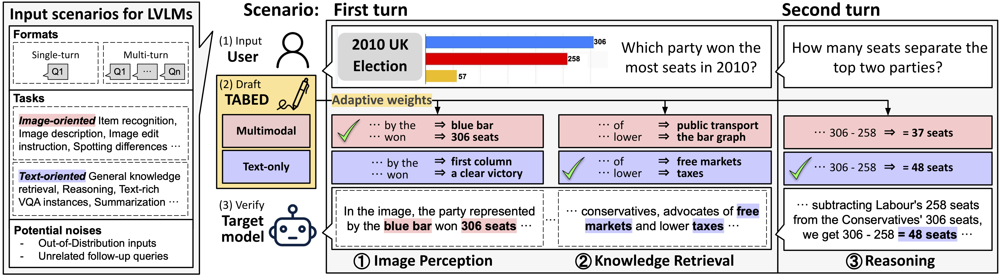
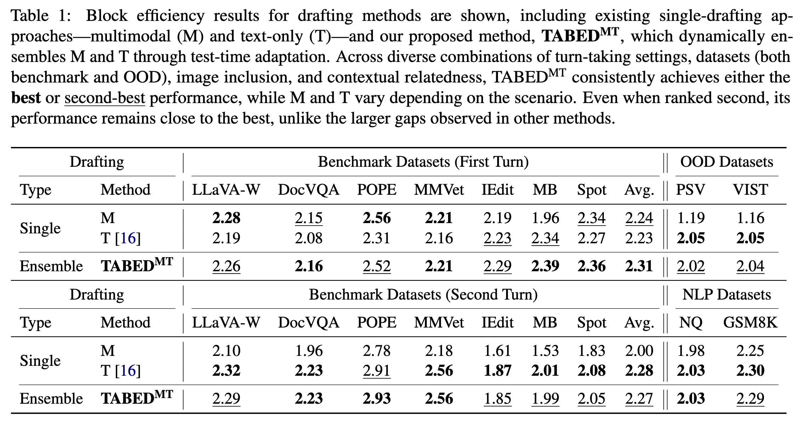

# TABED: Test-Time Adaptive Ensemble Drafting for Robust Speculative Decoding in LVLMs

<p align="center">
    <a href="https://scholar.google.com/citations?user=XJXKp60AAAAJ&hl=en" target="_blank">Minjae Lee</a><sup>1</sup>,
    <a href="https://scholar.google.com/citations?user=Q-ARWkwAAAAJ&hl=en" target="_blank">Wonjun Kang</a><sup>1</sup>,
    <a href="https://dblp.org/pid/331/2300.html" target="_blank">Byeongkeun Ahn</a><sup>1</sup>,
    <a href="https://scholar.google.com/citations?user=TSo70_YAAAAJ&hl=en" target="_blank">Christian Classen</a><sup>2</sup>,
    <a href="https://scholar.google.com/citations?user=G1EpeWYAAAAJ&hl=en" target="_blank">Kevin Galim</a><sup>1</sup>,
    <a href="https://scholar.google.com/citations?user=IXJcR1gAAAAJ&hl=en" target="_blank">Seunghyuk Oh</a><sup>1</sup>,
    <a href="https://scholar.google.com/citations?user=grTN4yQAAAAJ&hl=en" target="_blank">Minghao Yan</a><sup>2</sup>,
    <a href="https://scholar.google.com/citations?user=Oyy8aDMAAAAJ&hl=en" target="_blank">Hyung Il Koo</a><sup>1</sup>,
    <a href="https://kangwooklee.com/aboutme/" target="_blank">Kangwook Lee</a><sup>2,3</sup>
</p>
<p align="center">
    <sup>1</sup><a href="https://furiosa.ai/" target="_blank">FuriosaAI</a>, <sup>2</sup><a href="https://www.wisc.edu/" target="_blank">UW-Madison</a>, <sup>3</sup><a href="https://www.krafton.com/" target="_blank">KRAFTON</a>
</p>

<p align="center">
    <a href="https://arxiv.org/abs/2601.20357">
        
    </a>
    <a href="https://2026.eacl.org/">
        
    </a>
    <a href="#-poster">
    
    </a>
</p>

> **Note:** This paper has been accepted to [EACL 2026](https://2026.eacl.org/).
>
> 


<p align="center">

</p>
<p align="center">Figure 1. <b>Overview of TABED. </b></p>


***

## 📝 Abstract

Speculative decoding (SD) has proven effective for accelerating LLM inference by quickly generating draft tokens and verifying them in parallel. However, SD remains largely unexplored for Large Vision-Language Models (LVLMs), which extend LLMs to process both image and text prompts. To address this gap, we benchmark existing inference methods with small draft models on 11 datasets across diverse input scenarios and observe scenario-specific performance fluctuations. Motivated by these findings, we propose **Test-time Adaptive Batched Ensemble Drafting (TABED)**, which dynamically ensembles multiple drafts obtained via batch inference by leveraging deviations from past ground truths available in the SD setting. The dynamic ensemble method achieves an average robust walltime speedup of 1.74× over autoregressive decoding and a 5% improvement over single drafting methods, while remaining training-free and keeping ensembling costs negligible through parameter sharing. With its plug-and-play compatibility, we further enhance TABED by integrating advanced verification and alternative drafting methods.

***

## 🔗 Checkpoints

In the [Huggingface page](https://huggingface.co/mjbooo/models), the following model checkpoints are released:

| Model | Parameters | Training method |
|-------|------------|------------|
| LLaVA-1.5-68m | 68M | LLaVA-1.5 |
| LLaVA-OV-68m | 68M | LLaVA-OneVision |
| LLaVA-1.5-160m | 160M | LLaVA-1.5 |
| LLaVA-1.5-290m | 290M | LLaVA-1.5 |

***

## ⚙️ Setup

### Prerequisites
- Python 3.10+
- CUDA 12.1+ (for GPU acceleration)
- PyTorch 2.3.1+

### Installation (using uv)

```bash
# Clone the repository
git clone https://github.com/furiosa-ai/TABED.git
cd TABED
```

[uv](https://github.com/astral-sh/uv) provides fast, reproducible environment setup.

```bash
# Run the install script (installs uv if needed)
./install.sh

# Activate the environment
source .venv/bin/activate
```

### Environment Configuration

```bash
# Set your Hugging Face token for model access
export HF_TOKEN="your_huggingface_token"
```

***


## 🚀 Running Experiments

### Drafting Methods

This repository supports various drafting configurations:
#### 1. Single Drafting Method
- M (Multimodal) Uses full multimodal input
- T (Text-only) Uses only text input
- C (Caption) Uses image captions
- P (Pool): Uses pooled image features

#### 2. Static Ensemble Drafting Method ([In-batch Ensemble Drafting; IbED](https://openreview.net/pdf?id=ffDhpmwqdu))

- MT
- MTC
- MTP
- MTCP

#### 3. Dynamic Ensemble Drafting Method (Test-Time Adaptive Ensemble Drafting; TABED)
- **TabedMT** 
- **TabedMTC** 
- **TabedMTP** 
- **TabedMTCP**

### Reproducing Paper Results

We provide two evaluation scripts for comprehensive benchmarking:
<p align="center">

</p>
<p align="center"> Table 1. Block efficiency results for drafting methods.</p> 

```bash
# Single-turn experiments
bash run_scripts/first_ALL.sh

# Multi-turn experiments (only if the first-turn expts are run)
bash run_scripts/second_ALL.sh
```


***

## 🙏 Acknowledgements

This project builds upon the work of several open-source repositories:
- [LLaVA](https://github.com/haotian-liu/LLaVA)
- [llava-hf (huggingface)](https://huggingface.co/llava-hf)

***

## 📊 Poster

<p align="center">

</p>

<p align="center">
<a href="asset/EACL26-TABED-Poster.pdf">

</a>
</p>

***

## 📋 TODO
- Release batched inference rather than sequential inference

***

## 📖 Citation

If you find this work useful, please cite our paper:

```bibtex
@article{lee2026tabed,
  title={TABED: Test-Time Adaptive Ensemble Drafting for Robust Speculative Decoding in LVLMs},
  author={Lee, Minjae and Kang, Wonjun and Ahn, Byeongkeun and Classen, Christian and Galim, Kevin and Oh, Seunghyuk and Yan, Minghao and Koo, Hyung Il and Lee, Kangwook},
  journal={arXiv preprint arXiv:2601.20357},
  year={2026}
}
```

***