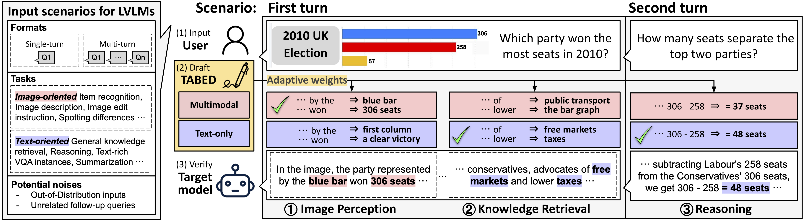

# TABED: Test-Time Adaptive Ensemble Drafting for Robust Speculative Decoding in LVLMs

<p align="center">
    <a href="https://scholar.google.com/citations?user=XJXKp60AAAAJ&hl=en" target="_blank">Minjae Lee</a><sup>1</sup>,
    <a href="https://scholar.google.com/citations?user=Q-ARWkwAAAAJ&hl=en" target="_blank">Wonjun Kang</a><sup>1</sup>,
    <a href="https://dblp.org/pid/331/2300.html" target="_blank">Byeongkeun Ahn</a><sup>1</sup>,
    <a href="https://scholar.google.com/citations?user=TSo70_YAAAAJ&hl=en" target="_blank">Christian Classen</a><sup>2</sup>,
    <a href="https://scholar.google.com/citations?user=G1EpeWYAAAAJ&hl=en" target="_blank">Kevin Galim</a><sup>1</sup>,
    <a href="https://scholar.google.com/citations?user=IXJcR1gAAAAJ&hl=en" target="_blank">Seunghyuk Oh</a><sup>1</sup>,
    <a href="https://scholar.google.com/citations?user=grTN4yQAAAAJ&hl=en" target="_blank">Minghao Yan</a><sup>2</sup>,
    <a href="https://scholar.google.com/citations?user=Oyy8aDMAAAAJ&hl=en" target="_blank">Hyung Il Koo</a><sup>1</sup>,
    <a href="https://kangwooklee.com/aboutme/" target="_blank">Kangwook Lee</a><sup>2,3</sup>
</p>
<p align="center">
    <sup>1</sup>FuriosaAI, <sup>2</sup>UW-Madison, <sup>3</sup>KRAFTON AI
</p>

<p align="center">
    <!-- TODO: Add project page link -->
    <!-- <a href="https://your-project-page.github.io/">
        
    </a> -->
    <!-- TODO: Add arXiv link when available -->
    <!-- <a href="https://arxiv.org/abs/XXXX.XXXXX">
        
    </a> -->
</p>

<p align="center">

</p>
<p align="center"><b>Figure 1.</b></p>

***

## 📝 Abstract

Speculative decoding (SD) has proven effective for accelerating LLM inference by quickly generating draft tokens and verifying them in parallel. However, SD remains largely unexplored for Large Vision-Language Models (LVLMs), which extend LLMs to process both image and text prompts. To address this gap, we benchmark existing inference methods with small draft models on 11 datasets across diverse input scenarios and observe scenario-specific performance fluctuations. Motivated by these findings, we propose **Test-time Adaptive Batched Ensemble Drafting (TABED)**, which dynamically ensembles multiple drafts obtained via batch inference by leveraging deviations from past ground truths available in the SD setting. The dynamic ensemble method achieves an average robust walltime speedup of 1.74× over autoregressive decoding and a 5% improvement over single drafting methods, while remaining training-free and keeping ensembling costs negligible through parameter sharing. With its plug-and-play compatibility, we further enhance TABED by integrating advanced verification and alternative drafting methods.

***

## 🔗 Checkpoints

In the [Google Drive link](https://drive.google.com/drive/folders/1VO5XB4piOBQH-nXk9q-nXAzVvtPjiHRY?usp=sharing), the following model checkpoints are released:

| Model | Parameters | Training method |
|-------|------------|------------|
| LLaVA-1.5-68m | 68M | LLaVA-1.5 |
| LLaVA-OV-68m | 68M | LLaVA-OneVision |
| LLaVA-1.5-160m | 160M | LLaVA-1.5 |
| LLaVA-1.5-290m | 290M | LLaVA-1.5 |

***

## ⚙️ Setup

<!-- TODO: Complete setup instructions -->

### Prerequisites
```bash
# TODO
```

### Installation

```bash
# TODO
```

***

## ⚡ Quickstart

<!-- TODO: Add quickstart code example -->

```python
# TODO
```

***

## 🚀 Running Experiments

<!-- TODO: Add evaluation commands and configurations -->

### Evaluation

```bash
# TODO
```

### Reproducing Paper Results

```bash
# TODO
```

***

## 📊 Results

<!-- TODO: Add results table or figures -->

***

## 🙏 Acknowledgements

<!-- TODO: Add acknowledgements to relevant repositories -->

This project builds upon the work of several open-source repositories:
- [LLaVA](https://github.com/haotian-liu/LLaVA)
- [LLaVA-OneVision](https://github.com/LLaVA-VL/LLaVA-NeXT)
<!-- TODO: Add other relevant repositories -->

***

## 📖 Citation

If you find this work useful, please cite our paper:

```bibtex
# Todo
```

***

## 📋 TODO

The following sections need to be completed:

### High Priority
- [ ] Add arXiv link and badge once paper is published
- [ ] Add project page link (if applicable)
- [ ] Add teaser/overview figure (`docs/teaser.png`)
- [ ] Complete Setup section with actual installation commands
- [ ] Add `requirements.txt` file
- [ ] Add Quickstart code example with minimal working demo

### Documentation
- [ ] Add inference code and usage instructions
- [ ] Add evaluation commands with configuration files
- [ ] Add commands to reproduce paper results
- [ ] Add results table/figures from the paper
- [ ] Add dataset information (11 datasets mentioned in abstract)

### Optional Enhancements
- [ ] Add License file and badge
- [ ] Add demo script (`demo.py`)
- [ ] Add configuration files for different experiments
- [ ] Add Acknowledgements section with relevant repositories
- [ ] Add Features/Overview section highlighting key contributions
